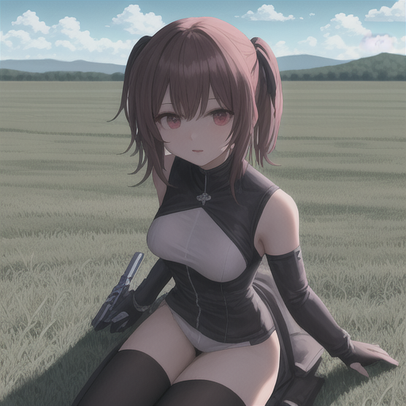

## About

This repository is an experimental implementation of [Consistory](https://arxiv.org/abs/2402.03286). **This is an unofficial implementation.**

## Note

Currently, it works only with the Stable Diffusion v1.5 model and at a resolution of 512x512.
Due to a rough implementation of the self-attention layers, a GPU with 24GB of memory is required for simultaneous generation of 4 images. (fp16)

Implementing self-attention interactions across batches becomes complicated when using CFG, and it also increases memory consumption. Therefore, we support only generation with a fixed CFG of 1.0 using LCM-LoRa.
As a result, the effects may not be exactly as described in the paper, but they are sufficiently noticeable.


## Environment

*Python* 3.10.9
*CUDA* 12.2

## Installation

```
python -m venv venv
source venv/bin/activate
```

```
pip install -r requirements.txt
```


### Downloading the Base Model

```
mkdir datasets
mkdir models

cd ./models
git clone some_diffusers_sd_15_model_from_huggin_face
# ex) git clone https://huggingface.co/runwayml/stable-diffusion-v1-5 or some_sd_15_based_anime_model
```


## Inference

### Inference (Subject Driven)

Subject Driven Inference is achieved through self-attention between batches of generated images, interpolation with vanilla queries, and feature infusion, which improves the consistency of generated images across batches.

**Command**

```
python inference_consistory.py --guidance_scale 1.0 --num_inference_steps 10 --keywords "1girl" --prompt "1girl, best quality, ultra detailed, sitting on the beach" "1girl, best quality, ultra detailed, resting on the wood" "1girl, best quality, ultra detailed, shoot guns and run the battlefield"
```

### Sample 

#### Generated Images 
   

   


### Inference with Reference Image

The method of using self-attention to maintain consistency is also seen in other papers. As an experimental feature, when a reference image is specified, it is added to the beginning of the batch, and self-attention and feature infusion are performed with this reference image.

**Command**

```
python inference_consistory.py --guidance_scale 1.0 --num_inference_steps 10 --reference_image datasets/sample/00006_i2i.png  --keywords "1women" "long_hair" " cap" --prompt "1women, long_hair,  cap, best quality, ultra detailed, sitting on the beach" "1women, long_hair,  cap, best quality, ultra detailed, resting on the wood" "1women, long_hair,  cap,  best quality, ultra detailed, shoot guns and run the battlefield"
```

**Reference Image**


**Generated Images**

   

**Generated Images (Without Reference)**

   